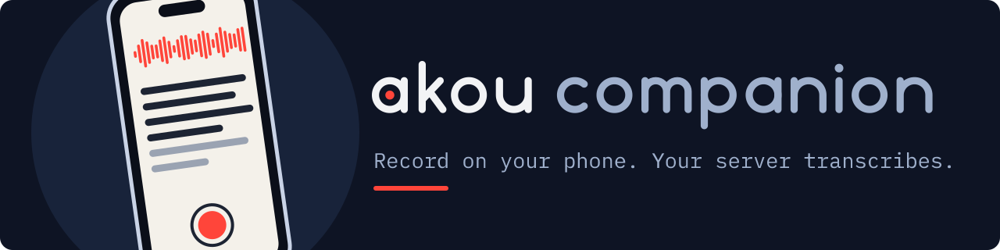

<p align="center">
  
</p>

<h1 align="center">akou-companion</h1>

<p align="center">
  <a href="https://github.com/GeiserX/akou-companion/actions/workflows/ci.yml"></a>
  <a href="LICENSE"></a>
</p>

akou-companion is an iPhone app that records on the phone and shows a live transcript from your own [akou](https://github.com/GeiserX/akou) server. The recording stays on the phone as an Ogg Opus file; when you stop, the server runs its final transcription pass and keeps the audio.

It talks to any akou server you point it at, with a URL and an `ak_` key. Nothing goes through a third party.

Status: early. This repository holds AkouKit (the tested core) and the app's record screen; there is no build to install yet. The milestones are in [docs/DESIGN.md](docs/DESIGN.md):

- M0, the server's live route: done in akou
- M1, foreground recording with live text and upload: in progress
- M2, locked-screen recording, Action button, Live Activity, offline queue: in progress
- M3, the server as the library, a last-recording summary and a recent-recordings widget: in progress
- M4, QR pairing and the Apple Watch: planned ([docs/M4.md](docs/M4.md))

## Features

What is built today, in AkouKit:

- Opus encoding through libopus at 16 kHz mono, 24 kbit/s, 20 ms frames: about 11 MB per hour
- Ogg pages of 200 ms that are byte-identical to ffmpeg's muxer, checked against an ffmpeg-made file
- A live client for akou's `GET /v1/live`: one WebSocket, Ogg pages up, words down
- A live session on top of it that survives a slow or dropped server: a 5 s send queue, a fresh session with backoff when it falls behind or the network drops, and a marked gap for the audio it missed
- The live transcript: tokens joined into words, lines on sentence ends and pauses, gaps kept in place
- A server probe for the settings screen: is it akou, does the key work, can it show live text
- The `https`-or-private-address rule for where audio and the key may go

In the app: a record screen with a workspace per recording, the elapsed time and the live text, recording into `Application Support/Recordings/<id>.opus`, pausing for a call or Siri and resuming into the same file, and the Live Activity.

What comes next, milestone by milestone: recording on a locked phone, one press from the Action button, a Live Activity, the final transcript with tap-to-seek, the server as the library, and the Apple Watch.

## Quick start

AkouKit builds and tests on a Mac with Xcode 26 or later; the app needs [XcodeGen](https://github.com/yonaskolb/XcodeGen).

```bash
git clone https://github.com/GeiserX/akou-companion && cd akou-companion
swift test
xcodegen generate --spec App/project.yml && open App/AkouCompanion.xcodeproj
```

To run it on a phone, put your team id in `App/Config/Local.xcconfig` as `DEVELOPMENT_TEAM = <id>`.

## Documentation

- [Design and milestones](docs/DESIGN.md)
- [M4 plan](docs/M4.md): QR pairing and the Apple Watch
- [TestFlight](docs/TESTFLIGHT.md): putting a build on your own iPhone
- [The live protocol](docs/PROTOCOL.md): akou's `GET /v1/live`, frames, messages, close codes
- [akou server guide](https://github.com/GeiserX/akou/blob/main/docs/server.md): running the server the app talks to

## License

[GPL-3.0-or-later](LICENSE), with an additional permission under section 7 for distribution through Apple's App Store and TestFlight ([NOTICE](NOTICE)).
