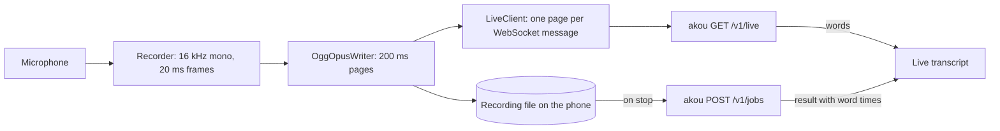

# Design and milestones

akou-companion is a thin iPhone recorder for an [akou](https://github.com/GeiserX/akou) server you run. The phone records and keeps the recording; the server does the recognition. Live text comes from the server's streaming recognizer over one WebSocket ([PROTOCOL.md](PROTOCOL.md)), and the final transcript from an ordinary akou job when the recording stops.

It works with any akou server. It needs a URL and an `ak_` key from the server's Keys page or `akou keys create`.

It is not a call recorder, an on-device transcriber or a hosted service, and nothing goes through a third party.

## How the pieces fit

- **AkouKit** (this repository's Swift package, tested with `swift test` on a Mac): `AkouProtocol` holds the message types, `AkouOpus` the libopus encoder and the Ogg page writer, `AkouClient` the live client and the server probe.
- **The app** (`App/`, generated with XcodeGen): the recorder, the transcript view, the uploader, the recordings list and the settings.
- **The widget extension**: the Live Activity, and from M2 the record control for the Action button, the Lock Screen and Control Center.

## Milestones

Each milestone ships on its own and ends with a measurement.

### M0: the server door, proven without a phone

akou gains `GET /v1/live`, Opus decoding on the live path, `capabilities.live` in `GET /v1/server`, and jobs that keep their audio. A command-line client streams a file at real-time pace. Measured: first-word latency, how far the last word lags the audio, bytes per hour, and live accuracy at 16, 24 and 32 kbit/s against PCM.

### M1: the app on TestFlight, in the foreground

Settings (URL, key in the Keychain, a test button), a big record button, the live transcript, the recordings list, the upload with an idempotency key, the final transcript with tap-to-seek on the local file. The local file is kept until the server confirms it kept the audio. Measured on a real phone, at home and on cellular: speech-to-screen lag, data per hour, and a 30-second airplane-mode gap that the final transcript fills.

### M2: background, one press to start, Live Activity, offline queue

Recording keeps going with the screen locked. One control starts and stops it from the Action button, the Lock Screen and Control Center, and the Live Activity shows the state, the elapsed time and the last line. Interruptions (a phone call, Siri) pause the recording; tapping the activity opens the app and continues in the same file. Recordings made with no server in reach upload by themselves when it comes back, once. The first task is a device test of the open question: can the record intent start recording cold from a locked phone without bringing the app forward?

### M3: the server as the library

Each recording has a workspace, chosen per recording. The recordings list comes from the server, so it survives a reinstall; playback streams from the server when there is no local copy; rename and delete go to the server. A setting keeps a copy on the phone too.

### M4: pairing by QR code and the Apple Watch

The server's Keys page shows a QR code with the URL and a new key, and the app scans it. The watch records the same Ogg Opus file and hands it to the phone, which uploads it as a normal recording; the watch shows no live text.

## Decisions

- **The phone's file is the recording of record.** The live socket is for text only and can drop at any time without losing audio.
- **No resume on the socket.** A reconnect is a new session; the final pass fills the gap. If gaps turn out long and frequent, the fix is on the phone (resend the last few pages), with no protocol change.
- **Opus in Ogg, made on the phone.** libopus through a pinned Swift package; the pages are the same bytes in the file and on the wire.
- **One live engine per server.** akou loads one streaming engine at a time, so phones on one server share it.
- **License.** GPL-3.0-or-later, with an additional permission under section 7 for distribution through Apple's App Store and TestFlight ([NOTICE](../NOTICE)).
