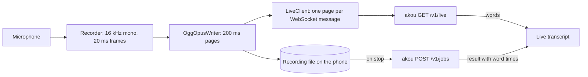

# Design and milestones

akou-companion is a thin iPhone recorder for an [akou](https://github.com/GeiserX/akou) server you run. The phone records and keeps the recording; the server does the recognition. Live text comes from the server's streaming recognizer over one WebSocket ([PROTOCOL.md](PROTOCOL.md)), and the final transcript from an ordinary akou job when the recording stops.

It works with any akou server. It needs a URL and an `ak_` key from the server's Keys page or `akou keys create`.

It is not a call recorder, an on-device transcriber or a hosted service, and nothing goes through a third party.

## How the pieces fit

- **AkouKit** (this repository's Swift package, tested with `swift test` on a Mac): `AkouProtocol` holds the message types, `AkouOpus` the libopus encoder and the Ogg page writer, `AkouClient` the live client and the server probe.
- **The app** (`App/`, generated with XcodeGen): the recorder, the transcript view, the uploader, the recordings list and the settings.
- **The widget extension**: the Live Activity, the record control for the Action button, the Lock Screen and Control Center, and the recent-recordings widget. It holds no key and makes no network request: the record intents run in the app process, and the widget reads only the App Group snapshot.

## Milestones

Each milestone ships on its own and ends with a measurement.

### M0: the server door, proven without a phone

akou gains `GET /v1/live`, Opus decoding on the live path, `capabilities.live` in `GET /v1/server`, and jobs that keep their audio. A command-line client streams a file at real-time pace. Measured: first-word latency, how far the last word lags the audio, bytes per hour, and live accuracy at 16, 24 and 32 kbit/s against PCM.

### M1: the app on TestFlight, in the foreground

Settings (URL, key in the Keychain, a test button), a big record button, the live transcript, the recordings list, the upload with an idempotency key, the final transcript with tap-to-seek on the local file. The local file is kept until the server confirms it kept the audio. Measured on a real phone, at home and on cellular: speech-to-screen lag, data per hour, and a 30-second airplane-mode gap that the final transcript fills.

### M2: background, one press to start, Live Activity, offline queue

Recording keeps going with the screen locked. One control starts and stops it from the Action button, the Lock Screen and Control Center, and the Live Activity shows the state, the elapsed time and the last line. Interruptions (a phone call, Siri) pause the recording; tapping the activity opens the app and continues in the same file. Recordings made with no server in reach upload by themselves when it comes back, once. The first task is a device test of the open question: can the record intent start recording cold from a locked phone without bringing the app forward?

### M3: the server as the library

Each recording has a workspace, chosen per recording and sent as a label in the job's metadata. The recordings list comes from the server, so it survives a reinstall; playback streams from the server when there is no local copy; rename and delete go to the server. A setting keeps a copy on the phone too.

Two more ways to reach a recording without opening the app:

- **"Last recording summary", an App Intent** for Siri, Shortcuts and the Action button. It answers with a short summary of the newest recording's final transcript. The summary is made on the phone with Apple's FoundationModels framework where the device has it (iOS 26 with Apple Intelligence on); elsewhere the answer is the transcript's opening sentences. akou has no summary route, so the server is never asked for one.
- **A recent-recordings widget** for the Home Screen and the Lock Screen: the last few recordings with their title, length and state (uploading, transcribing, done). The app writes a small snapshot of the list to the App Group container each time the list changes, and the widget reads only that snapshot. The extension holds no key and makes no network call.

### M4: pairing by QR code and the Apple Watch

The proposal for pairing is that the server's Keys page shows a QR code with the URL and a new key, and the app scans it; it waits on a decision because the code shows a working key. The watch records the same Ogg Opus file and hands it to the phone, which uploads it as a normal recording; the watch shows no live text. The design note and the spike plan are in [M4.md](M4.md).

## Decisions

- **The phone's file is the recording of record.** The live socket is for text only and can drop at any time without losing audio.
- **No resume on the socket.** A reconnect is a new session that starts at the recording's current position, and the final pass fills the gap. Replaying missed pages is not part of the protocol; if gaps turn out long and frequent in M1, that is a protocol change to design then.
- **Opus in Ogg, made on the phone.** libopus through a pinned Swift package; the pages are the same bytes in the file and on the wire.
- **The live send queue holds at most 5 s of audio.** The server closes a session with 4400 `too_fast` once 30 s of audio waits for its engine ([PROTOCOL.md](PROTOCOL.md)), so the phone stays far below that. A full queue never flushes a backlog: the phone closes the session and opens a new one from the current page, and the final pass fills what the live text missed.
- **The workspace is a label in the job's metadata.** akou's workspace routes exist only in its desktop app mode, not on a server, so the phone sends the workspace name in the job's `metadata` and filters the server's list by it on the phone (`GET /v1/jobs` searches titles, ids and states, not metadata).
- **Recording files can be written while the phone is locked.** They use the file protection class `completeUntilFirstUserAuthentication`, so a recording started or resumed on a locked phone can open and append to its file. The stricter classes do not fit: `complete` refuses any access while the phone is locked, and `completeUnlessOpen` cannot reopen a closed file, which continuing after an interruption needs.
- **The widget reads a snapshot, never the server.** The app writes the recent-recordings snapshot to the App Group container; the key stays in the app's Keychain entry.
- **The server is the library.** The recordings list is `GET /v1/jobs`, kept to the jobs whose `metadata.companion` is 1, so it survives a reinstall (the list is per key: a second phone with the same key sees the same recordings). The list has a chip per workspace found in the jobs' `metadata`. Rename is `PATCH /v1/jobs/{id}`; delete is `DELETE /v1/jobs/{id}`, which also deletes the audio the server kept.
- **Server audio plays without the key in a URL.** AVPlayer cannot add a header, and akou takes the key only as `Authorization: Bearer`. The player gets `akou-audio://<job id>`, and `AuthorizedAudioLoader` answers it with `Range` requests to `GET /v1/jobs/{id}/audio`, so seeking fetches only the bytes it needs. The phone's own file plays instead while it has one.
- **One live engine per server.** akou loads one streaming engine at a time, so phones on one server share it.
- **License.** GPL-3.0-or-later, with an additional permission under section 7 for distribution through Apple's App Store and TestFlight ([NOTICE](../NOTICE)).
